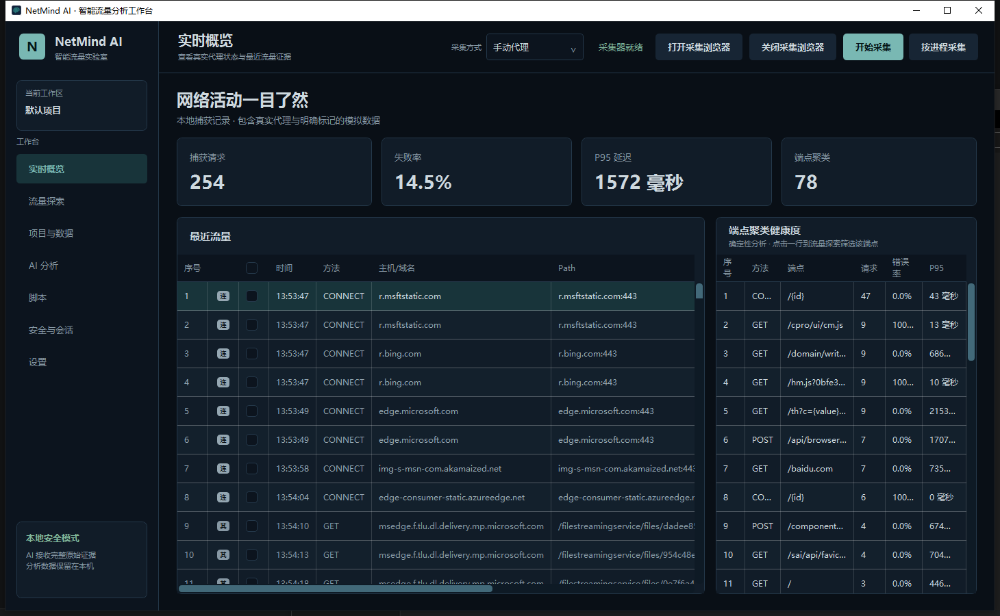
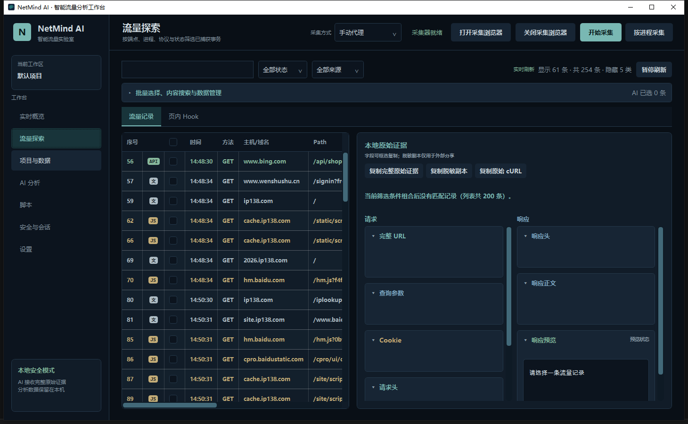
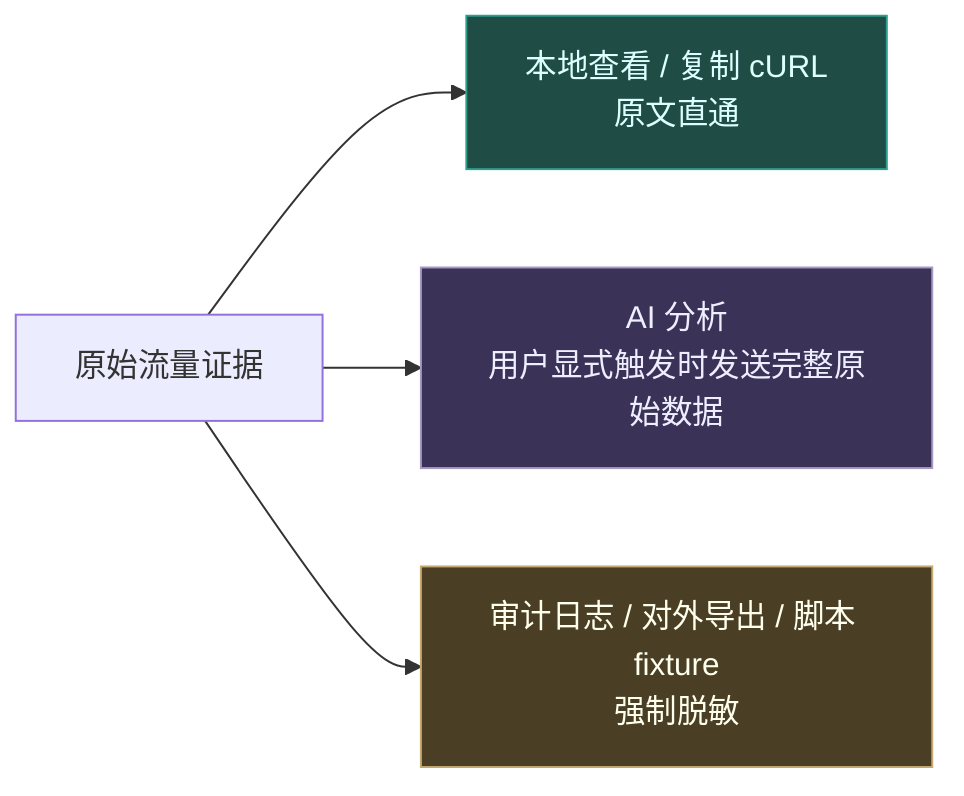
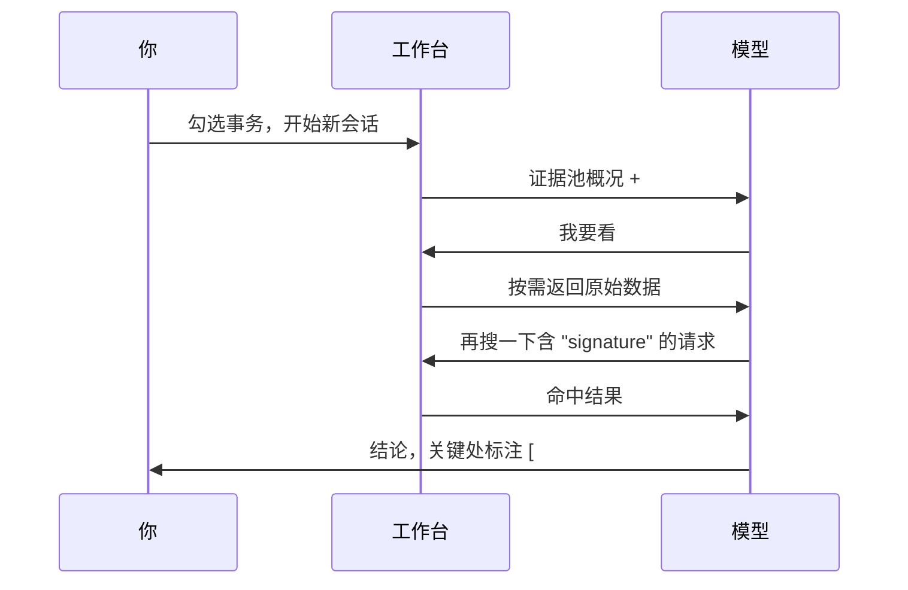
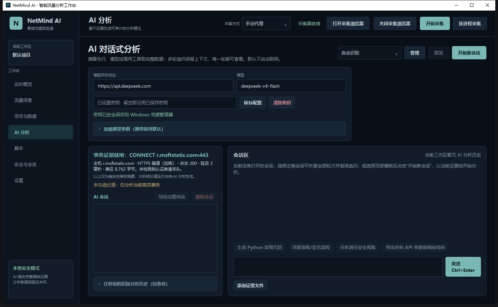
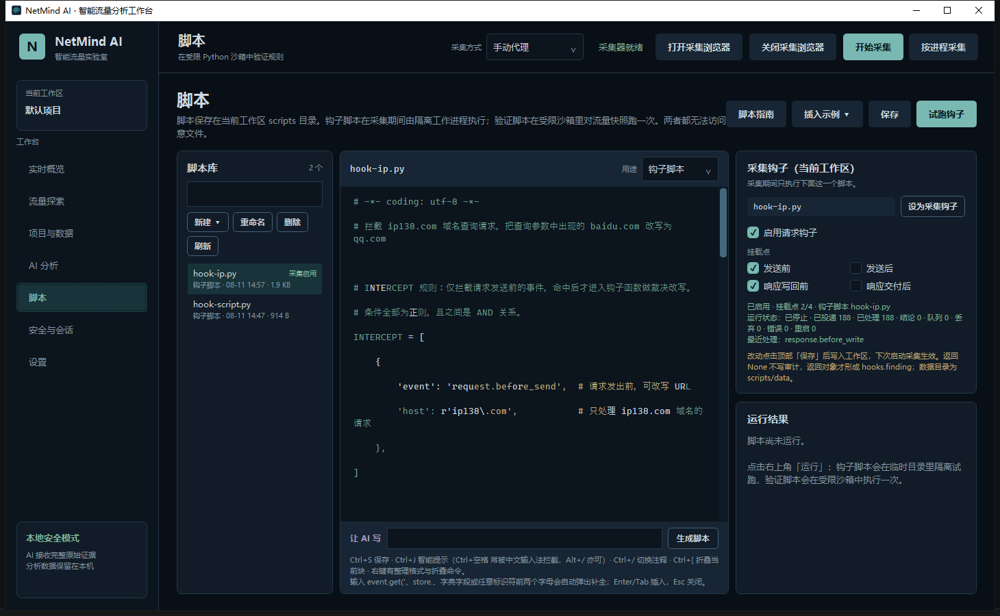
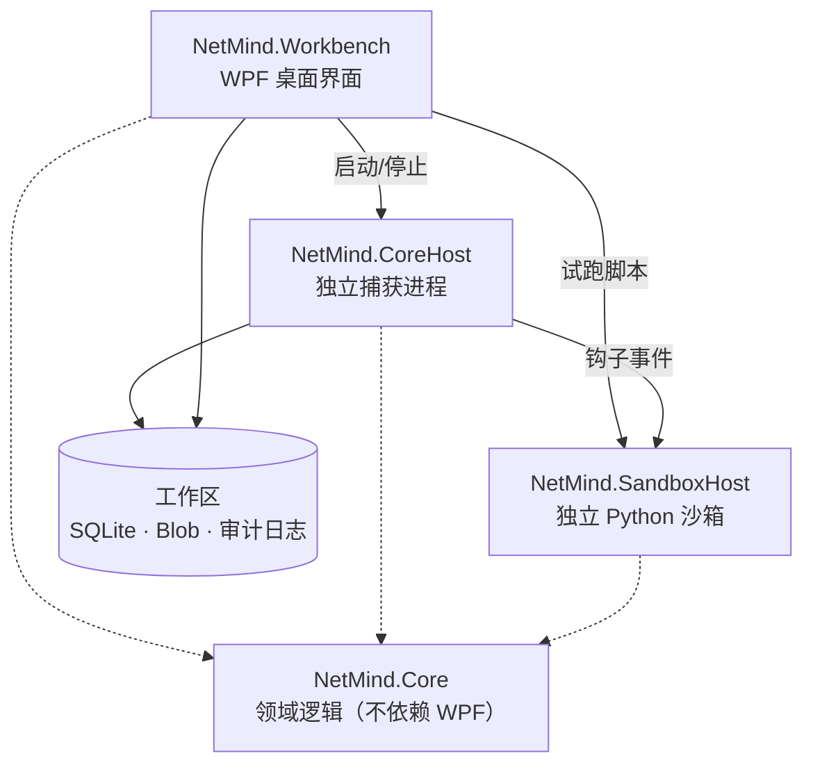

# NetMind AI

**Windows 上的中文流量分析工作台。** 抓 HTTP/HTTPS 流量、看清每一个请求的原始证据、用 Python 脚本拦截改写、再交给 AI 帮你理解协议。

面向接口调试、协议逆向、抓包取证——**分析对象应当是你自己拥有或获授权的测试账号与系统。**

<!--
  截图放在 docs/images/ 下，文件名如下即可自动显示：
  overview.png / traffic.png / ai.png / script.png
-->


---

## 它能做什么

| | |
| --- | --- |
| 🌐 **抓包** | HTTP/1.1 显式代理，可选 HTTPS 正文解密；也支持 WinDivert 静默抓包（免改代理设置） |
| 🔍 **看证据** | 每条事务的原始 URL、查询参数、请求头、Cookie、请求/响应正文，逐字节可查、可复制成 cURL |
| 🧩 **改流量** | Python 钩子脚本在四个挂载点观察流量；声明拦截规则后可**修改请求/响应并向下传播** |
| 🤖 **问 AI** | 对话式分层取证：模型按需取数，不是一次性把流量全塞给它 |
| 📦 **归档** | 工作区隔离、SHA-256 内容寻址存储、JSONL 审计日志、HAR/ZIP 导出 |

**零第三方 NuGet 依赖，可完全离线构建。** SQLite 走 Windows 自带的 `winsqlite3.dll`，JSON 用 BCL，代码编辑器是本地实现。

---

## 快速上手

### 1. 安装

从 [Releases](../../../releases) 下载对应的 ZIP，**完整解压后**双击 `NetMind.Workbench.exe`。

| 包 | 体积 | 要求 |
| --- | --- | --- |
| `...-win-x64.zip` | ~124 MB | 无需安装 .NET，解压即用 |
| `...-win-x64-framework-dependent.zip` | ~2 MB | 需先装 [.NET 10 桌面运行时 x64](https://dotnet.microsoft.com/download/dotnet/10.0) |

> Python 脚本功能需要本机安装 Python 3；不装也不影响抓包与 AI 分析。

### 2. 开始抓包

1. 点 **开始采集** —— 代理监听 `127.0.0.1:8877`
2. 点 **打开采集浏览器** —— 会启动一个独立配置的 Edge/Chrome，只改这个浏览器进程的代理，**不动 Windows 全局代理**
3. 在这个浏览器里访问目标站点



### 3. ⚠️ HTTPS 想看正文，必须先开解密

**这是新用户最容易卡住的地方。**

默认情况下 HTTPS 只走加密隧道：你会看到一条 `CONNECT example.com:443`，但**没有 URL、没有正文，钩子也拦不到**（加密隧道不可钩）。

要抓到真实请求：**项目与数据** 页 → 启用 HTTPS 解密 → 信任工作区 CA → 重新开始采集。

> 每个工作区有独立 CA，只写入当前用户证书存储，停用时会撤销。**程序不会绕过证书固定**——遇到固定证书的站点请加入直通名单。

另外注意：流量表默认只显示 `接口数据 / 脚本 / 文档 / 其他` 四类，「连接」「图片」「样式」等默认隐藏。列表为空时界面会直接告诉你原因。

---

## 三条数据路径（重要）

同一份证据有三个出口，语义完全不同：



**AI 分析会发送未脱敏的原始数据**（因为脱敏后的证据没法做协议分析）。请只对你自己的测试账号使用。审计日志和主动分享的导出副本始终走独立的脱敏路径。

---

## AI 分析：对话式分层取证

不是把流量一股脑塞给模型，也不是 RAG。



长期历史只保留你的问题、最终回答和轻量证据账本（工具引用、结果规模、SHA-256），**上一轮的工具原文不会在追问时重复上传**。



---

## 脚本与钩子

脚本存在工作区 `scripts/` 目录，一个工作区可以放多个。页面左边选脚本、中间写、右边决定它在采集里怎么用。

**两种用途，共用一个编辑器：**

- **钩子脚本** —— 采集期间由隔离的 Python 工作进程调用，定义 `on_before_send` 等函数
- **验证脚本** —— 对当前流量快照跑一次，用 `assert` 表达规则，退出码即结论

### 只观察（默认）

```python
def on_before_send(event):
    # 返回 None 什么都不做；返回 dict 形成一条审计结论
    if 'login' not in (event.get('url') or ''):
        return None
    return {'kind': 'auth.attempt', 'url': event.get('url')}
```

代理**不等待**脚本，脚本崩了也不影响抓包。

### 拦截改写（需显式声明）

```python
# 只有命中规则的请求才阻塞等待裁决，其余流量仍是即发即忘
INTERCEPT = [
    {'event': 'request.before_send', 'url': r'/v\d+/user/login', 'method': r'^POST$'},
]

def on_before_send(event):
    return {
        'headers': {'X-Sign': None},          # None 表示删除该头
        'body': '{"password":"changed"}',     # Content-Length 由宿主重算
        'finding': {'kind': 'probe.sign-removed'},
    }
```

规则字段全是正则（`url` / `method` / `host` / `endpoint` / `body` / `status` / `headers`），条件之间是 AND。**裁决超时、脚本崩溃、改写超限一律按原样放行**，绝不阻塞浏览器。

### 编辑器

内置钩子与 fixture 两套 API 智能提示，**词表反射自运行时契约**，不会出现"照提示写、运行时取不到值"。

| 快捷键 | 作用 |
| --- | --- |
| `Ctrl+S` | 保存 |
| `Ctrl+J` | 智能提示（`Ctrl+空格` 常被中文输入法拦截） |
| `Ctrl+/` | 切换注释，支持多行 |
| `Ctrl+[` | 折叠当前代码块 |

右键还有整理格式、折叠全部/展开全部。**不会写？在编辑器下方描述需求，让 AI 写。**



完整契约见 [docs/scripting.md](docs/scripting.md)。

---

## 安全边界

- **HTTPS 解密默认关闭**，每个工作区独立 CA，只信任当前用户存储，停用即撤销
- **不绕过证书固定**；可配置最多 200 条加密直通域名
- **脚本沙箱**：静态能力检查 + `-I -B -S` 隔离参数 + Windows Job Object（单进程、256 MB、宿主退出即终止）+ 无网络、无文件系统
- **静默抓包纯嗅探**（`WINDIVERT_FLAG_SNIFF`），绝不拦截或重注入
- **代理只监听回环地址**，不对外暴露
- API 密钥只存 Windows 凭据管理器，设置文件与审计日志不落密钥

---

## 架构



捕获和脚本执行都在**独立进程**里：抓包进程崩了不会带走界面，脚本再怎么写坏也碰不到工作台。

每个**工作区**是完整的隔离边界，独立持有流量数据库、正文 Blob、记录组、AI 会话与审计日志。

---

## 从源码构建

需要 Windows 10/11 与 **稳定版 .NET 10 SDK**（仓库通过 `global.json` 锁定 10.0.302，不接受预览版）。

```powershell
dotnet run --project src/NetMind.Workbench/NetMind.Workbench.csproj
```

```powershell
# 全量构建 + 冒烟测试
dotnet build NetMind.slnx --configuration Release
dotnet run --project src/NetMind.SmokeTests/NetMind.SmokeTests.csproj --configuration Release
```

冒烟测试是普通控制台程序（不引入测试框架，保持离线可构建），当前 32 个套件覆盖存储、协议解析、代理、TLS 解密、钩子拦截、AI 编排等。`--list` 可列出全部套件并定向运行。

打包：

```powershell
./packaging/publish-win-x64.ps1 -Version 0.9.0                      # 自包含
./packaging/publish-win-x64.ps1 -Version 0.9.0 -SelfContained:$false # 不含运行时
./packaging/verify-release.ps1  -Version 0.9.0                      # 校验哈希与清单
```

---

## 文档

| 文件 | 内容 |
| --- | --- |
| [docs/installation.md](docs/installation.md) | 安装、运行、发布 |
| [docs/scripting.md](docs/scripting.md) | 脚本与钩子完整契约 |
| [docs/development.md](docs/development.md) | 架构与设计规范 |
| [docs/implementation-status.md](docs/implementation-status.md) | 按日期记录的实现纪要 |

---

## 免责声明

本工具用于**你自己拥有或已获明确授权**的系统的调试与安全测试。使用者需自行确保符合所在地法律法规与目标服务的条款。作者不对滥用承担责任。
